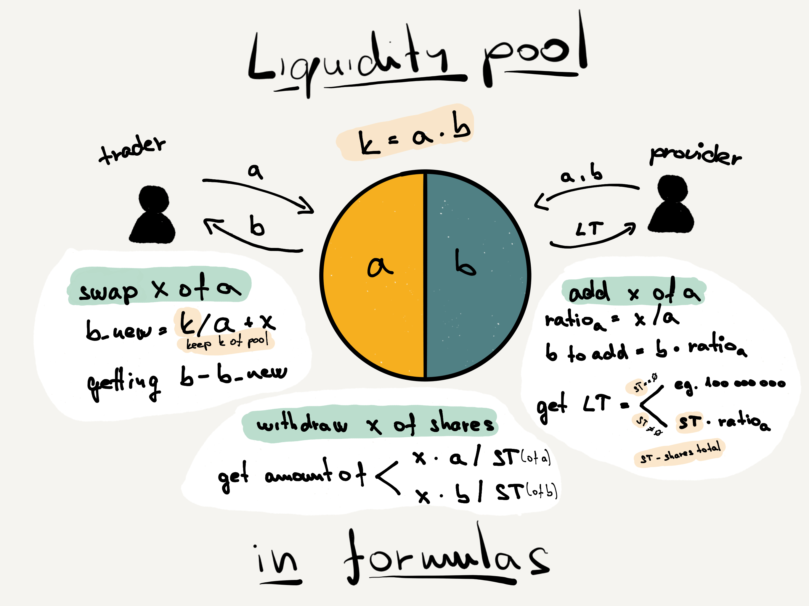
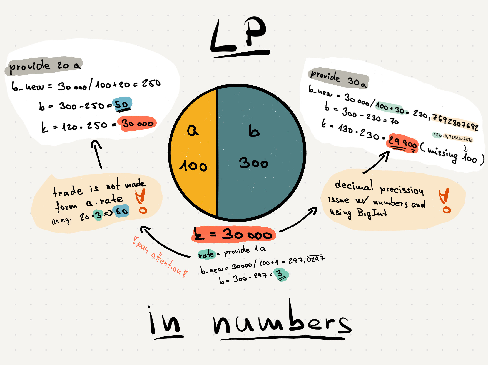
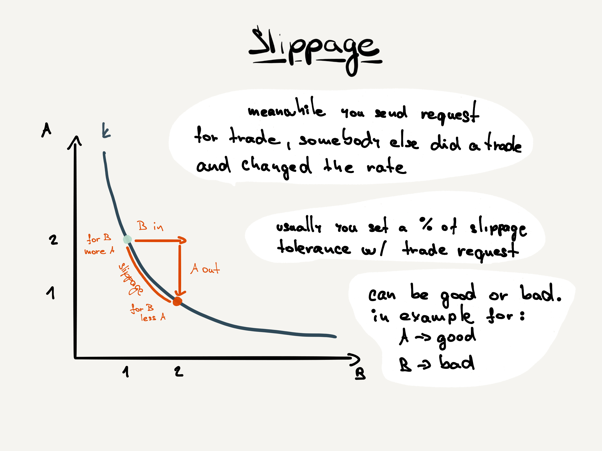
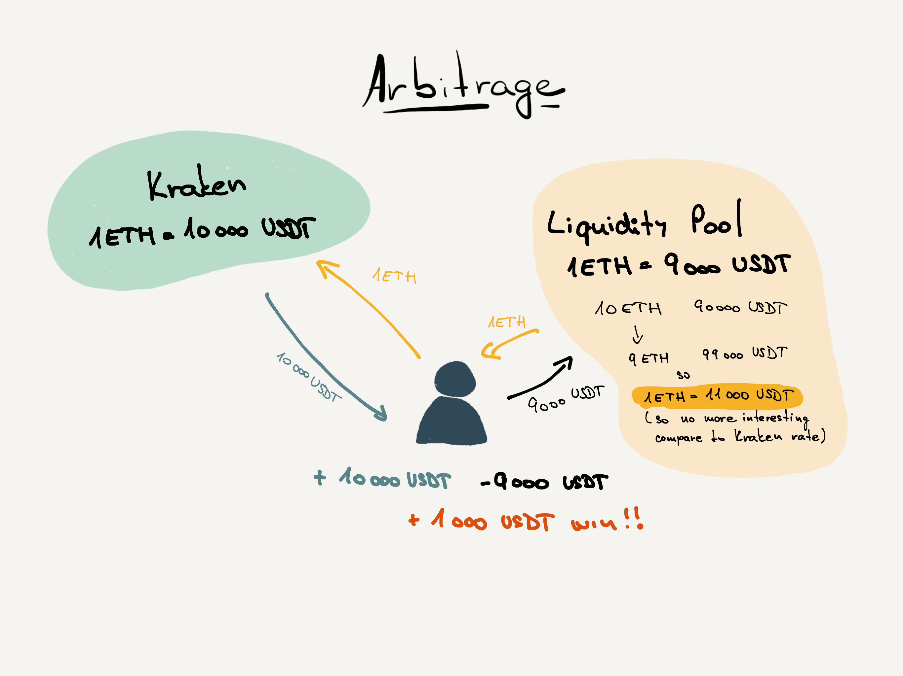

# AMM
Example of simple Automated Market Maker on Elrond network for studying purpose.

Inspired by tutorial https://learn.figment.io/tutorials/build-polkadot-amm-using-ink.

## Stack
**Contract:** [Rust](./src/amm.rs)

**Frontend:** [SvelteKit framework](./fe-svelte-kit/)

## Links
Working example: https://amm-elrond.netlify.app/

https://user-images.githubusercontent.com/143357/210095255-3633ec8b-c1b7-4569-82b5-e30a319068f4.mov


## In Pictures
### Liquidity Pool (LP)
Collection of tokens or digital assets locked in a smart contract that provide essential liquidity to decentralized exchanges (DEX).
A DEX is an exchange that doesn't rely on a third party to hold users' funds. Instead, DEX users transact with each other directly.


Playing with numbers we can see:
- the rate isn't used in way we would expect at first glance
- the number precision issue casued by missing decimal numbers (contract is using BiguUint).
Based on the fact that basic unit (eg. Wei) for tokens are usually in 12-18 precision (1 ETH == 1000000000000000000 Wei) compare to used unit (eg. ETH)
is this inconsistency is hidden. In example below is difference noticable as we are using small numbers to demostrating it.



### Slippage
Slippage is the price difference between when you submit a transaction and when the transaction is confirmed on the blockchain.



### Arbitrage
Besides smart contract algorithms, liquidity pools rely on arbitrage traders to ensure a digital asset's quoted price is accurate.
Arbitrage is a strategy where traders capitalize on a slight price discrepancy on a token between two exchanges




## Run FE
Please check comments which polyfill to use for local dev and for production release in [vite.config.js](./fe-svelte-kit/vite.config.js).

In `fe-svelte-kit` directory run:
```
pnpm install
pnpm run dev
```

## Tests

Run tests:
NOTE: only my local ... if there is issue with compiling contract (`..unknown command: cargo.`) remove rust from `asdf` as it is in some collision w/ rustup.
```
erdpy contract build
erdpy contract test
```

## Interaction (deploy, querying, ...)
In examples is proxy set to https://devnet-gateway.elrond.com, change it if you want to work
with different chain

### For deploy/upgrade
Run interaction python script and chose `1. Deploy`
```
python3 ./interaction/playground.py --pem=./wallet/walletKey.pem --proxy=https://devnet-gateway.elrond.com
```

The contract is already deployed on address `erd1qqqqqqqqqqqqqpgqmq04sd9355zryhek7lly4a4sspxdwwg453ds53uesn` (devnet) or `erd1qqqqqqqqqqqqqpgqgczuv6u6mgdewj4amsm5nnysk3404md253ds92srw6` (testnet)

## Sources
- https://docs.rs/elrond-wasm/latest/elrond_wasm/
- https://docs.elrond.com/developers/overview/
- https://docs.elrond.com/sdk-and-tools/erdjs/erdjs/
- https://docs.elrond.com/sdk-and-tools/erdjs/erdjs-cookbook/
- https://medium.com/@henryhienton/how-to-create-a-crypto-wallet-generating-a-pem-file-on-the-elrond-devnet-network-e545ab3a4a11
- https://docs.elrond.com/sdk-and-tools/erdpy/deriving-the-wallet-pem-file/
- https://elrondnetwork.github.io/elrond-sdk-docs/erdjs/latest/modules/typesystem.html
